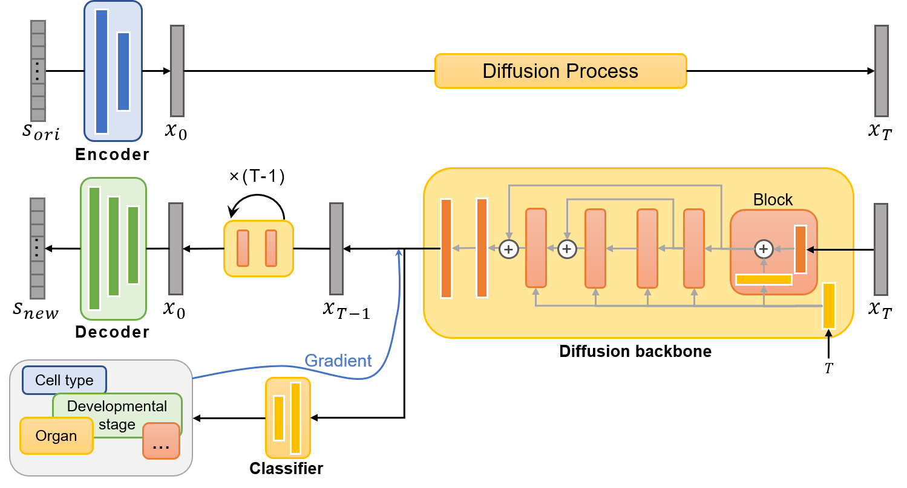

## scDiffusion: Conditional Generation of High-Quality Single-Cell Data Using Diffusion Model
Welcome to the code base for scDiffusion, a model developed for the generation of scRNA-seq data. This model combines the power of latent diffusion model and pre-trained model.

<!--  -->
<div align="center">  
      
</div>  


# Environment
```
pytorch                   1.13.0  
numpy                     1.23.4  
anndata                   0.8.0  
scanpy                    1.9.1  
scikit-learn              1.2.2  
blobfile                  2.0.0  
pandas                    1.5.1  
celltypist                1.3.0  
imbalanced-learn          0.11.0  
mpi4py                    3.1.4  
```

# Train the scDiffusion model

**Dataset:**
The data used for training the model is formatted in h5ad. You can download the dataset that used in the paper in https://figshare.com/s/49b29cb24b27ec8b6d72. For other formats, modify the code in ./guided_diffusion/cell_datasets_*.py. 

You can directly run the `train.sh` to complete all the training steps. Be aware to change the file path to your own.

Below are the complete steps for the training process:

- Step 1: Train the Autoencoder
Run `VAE/VAE_train.py`: Update the data_dir and save_dir to your local path, and adjust the num_genes parameter to match the gene number of your dataset. The pretrained weight of scimilarity can be found in https://zenodo.org/records/8286452, we used the annotation_model_v1 in this work. You can also train the autoencoder from scratch, this might need larger interation steps (15e4 steps would be good).

- Step 2: Train the diffusion backbone
First, modify the Autoencoder checkpoint path in `./guided_diffusion/cell_datasets_.py` to match your trained Autoencoder. Next, adjust the data_dir, model_name, and save_dir in `cell_train.py`, then execute the file. We trained the backbone for 80e4 steps.

- Step 3: Train the classifier
Ensure that the Autoencoder checkpoint path in `./guided_diffusion/cell_datasets_*.py` is correct. Set the NUM_CLASSES parameter in `guided_diffusion/script_util.py` to match the number of classes in your dataset. Then, modify the model_dir and data_dir in the `classifier_train.py` and execute the file. We trained the classifier for 20e4 steps.

# Generate new sample

**Unconditional generation:**

In `cell_sample.py`, change the model_path to match the trained backbone model's path and set the sample_dir to your local path. Running the file will generate new latent embeddings for the scRNA-seq data and save them in a .npz file. You can decode these latent embeddings and retrieve the complete gene expression data using `exp_script/script_diffusion_umap.ipynb` or `exp_script/script_static_eval.ipynb`.

**Conditional generation:**

In the `classifier_sample.py`, adjust the model_path and classifier_path to match the trained backbone model and the trained classifier, respectively. Also, update the sample_dir to your local path. The condition can be set in "main". Running the file will generate new latent embeddings under the given conditions. You can decode these embeddings the same way as in unconditional generation.

**Experiments reproduce:**

The scripts in the exp_script/ directory can be used to reproduce the results presented in the paper. You can refer the process in any of these scripts to rebuild the gene expression from latent space. The `exp_script/down_stream_analysis_muris.ipynb` can reproduce the marker genes result. The `exp_script/script_diffusion_umap_multi-condi.ipynb` can reproduce the result of two-conditonal generation. The `exp_script/script_diffusion_umap_trajectory.ipynb` can reproduce the result of Gradient Interpolation. The `exp_script/script_diffusion_umap.ipynb` can reproduce the UMAP shown in the paper. The `exp_script/script_static_eval.ipynb` can reproduce the statistical metrics mentioned in the paper.
