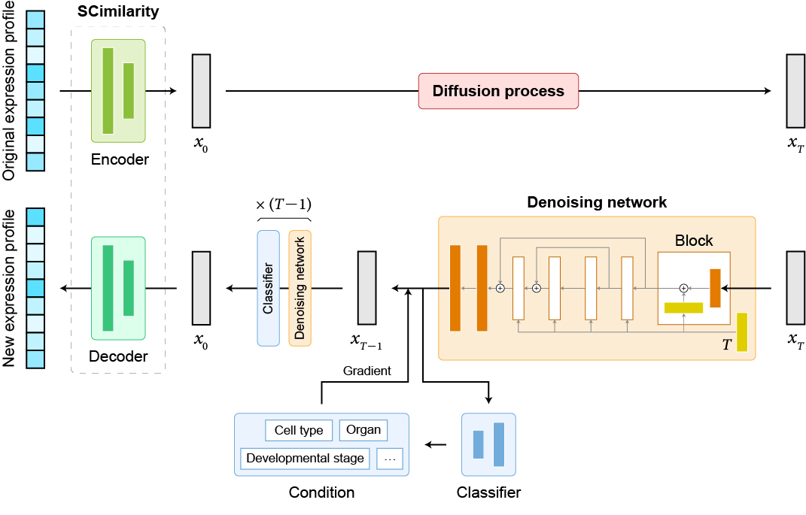

## scDiffusion: Conditional Generation of High-Quality Single-Cell Data Using Diffusion Model
Welcome to the code base for scDiffusion, a model developed for the generation of scRNA-seq data. This model combines the power of latent diffusion model and pre-trained model.

<!--  -->
<div align="center">  
      
</div>  


# Environment
```
pytorch                   1.13.0  
numpy                     1.23.4  
anndata                   0.8.0  
scanpy                    1.9.1  
scikit-learn              1.2.2  
blobfile                  2.0.0  
pandas                    1.5.1  
celltypist                1.3.0  
imbalanced-learn          0.11.0  
mpi4py                    3.1.4  
```

# Train the scDiffusion model

**Dataset:**
The data used for training the model is formatted in h5ad. You can download the dataset that used in the paper in https://figshare.com/s/49b29cb24b27ec8b6d72. For other formats (or your data has already been pre-possed), modify the code in ./guided_diffusion/cell_datasets_loader.py. The load_data function in the cell_datasets_loader.py only support not pre-processed row count data.

You can directly run the `train.sh` to complete all the training steps. Be aware to change the file path to your own.

Below are the complete steps for the training process:

- Step 1: Train the Autoencoder
Run `VAE/VAE_train.py`: cd VAE. Set the parameters *data_dir* and *save_dir* to your local path, and set the *num_genes* parameter to match the gene number of your dataset. The pretrained weight of scimilarity can be found in https://zenodo.org/records/8286452, we used the annotation_model_v1 in this work. Set the *state_dict* to the path where you store your downloaded scimilarity checkpoint. You can also train the autoencoder from scratch, this might need larger interation steps (larger than 1.5e5 steps would be good).

For example:
`python VAE_train.py --data_dir '/data1/lep/Workspace/guided-diffusion/data/tabula_muris/all.h5ad' --num_genes 18996 --save_dir '../output/checkpoint/AE/my_VAE' --max_steps 200000`

- Step 2: Train the diffusion backbone
Run `cell_train.py`: First, set the parameters *vae_path* to the path of your trained Autoencoder. Next, set the *data_dir*, *model_name*(the folder to save the ckpt), and *save_dir*(the path to place the *model_name* folder). We trained the backbone for 6e5 steps.

For example:
`python cell_train.py --data_dir '/data1/lep/Workspace/guided-diffusion/data/tabula_muris/all.h5ad' --vae_path 'output/checkpoint/AE/my_VAE/model_seed=0_step=150000.pt' --model_name 'my_diffusion' --save_dir 'output/checkpoint/backbone' --lr_anneal_steps 800000`

- Step 3: Train the classifier
Run `classifier_train.py`: Again, set the parameters *vae_path* to the path of your trained Autoencoder. Set the *num_class* parameter to match the number of classes in your dataset. Then, set the *model_path* to the path you would like to save the ckpt and execute the file. We trained the classifier for 2e5 steps.

For example:
`python classifier_train.py --data_dir '/data1/lep/Workspace/guided-diffusion/data/tabula_muris/all.h5ad' --model_path "output/checkpoint/classifier/my_classifier" --iterations 400000 --vae_path 'output/checkpoint/AE/my_VAE/model_seed=0_step=150000.pt' --num_class=12`

# Generate new sample

**Unconditional generation:**

Run `cell_sample.py`: set the *model_path* to match the trained backbone model's path and set the *sample_dir* to your local path. The *num_samples* is the number of cell to generate, and the *batch_size* is the number of cell generate in one diffusion reverse process.

For example:
`python cell_sample.py --model_path 'output/checkpoint/backbone/my_diffusion/model600000.pt' --sample_dir 'output/simulated_samples/muris' --num_samples 3000 --batch_size 1000`

 Running the file will generate new latent embeddings for the scRNA-seq data and save them in a .npz file. You can decode these latent embeddings and retrieve the complete gene expression data using `exp_script/script_diffusion_umap.ipynb` or `exp_script/script_static_eval.ipynb`.

**Conditional generation:**

Run `classifier_sample.py`: set the *model_path* and *classifier_path* to match the trained backbone model and the trained classifier, respectively. Also, set the *sample_dir* to your local path. The condition can be set in "main" (the param *cell_type* in the main() function refer to the cell_type you want to generate.). Running the file will generate new latent embeddings under the given conditions. 

For example:
`python classifier_sample.py --model_path 'output/checkpoint/backbone/my_diffusion/model600000.pt' --classifier_path 'output/checkpoint/classifier/my_classifier/model200000.pt' --sample_dir 'output/simulated_samples/muris' --num_samples 3000 --batch_size 1000`

You can decode these embeddings the same way as in unconditional generation.

For multi-conditional generation and gradiante interpolation, refer to the comments in the main() function and create_argparser() function (see the comments with *** mark).

**Experiments reproduce:**

The scripts in the exp_script/ directory can be used to reproduce the results presented in the paper. You can refer the process in any of these scripts to rebuild the gene expression from latent space. The `exp_script/down_stream_analysis_muris.ipynb` can reproduce the marker genes result. The `exp_script/script_diffusion_umap_multi-condi.ipynb` can reproduce the result of two-conditonal generation. The `exp_script/script_diffusion_umap_trajectory.ipynb` can reproduce the result of Gradient Interpolation. The `exp_script/script_diffusion_umap.ipynb` can reproduce the UMAP shown in the paper. The `exp_script/script_static_eval.ipynb` can reproduce the statistical metrics mentioned in the paper.
